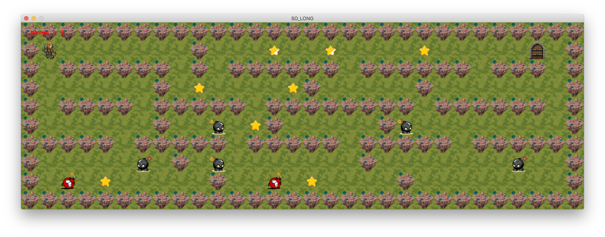
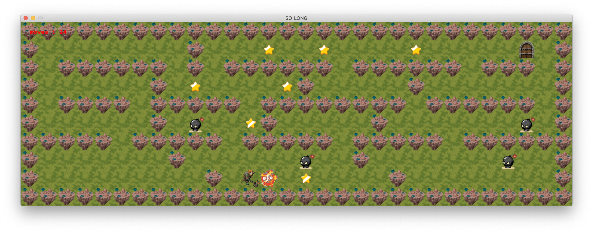
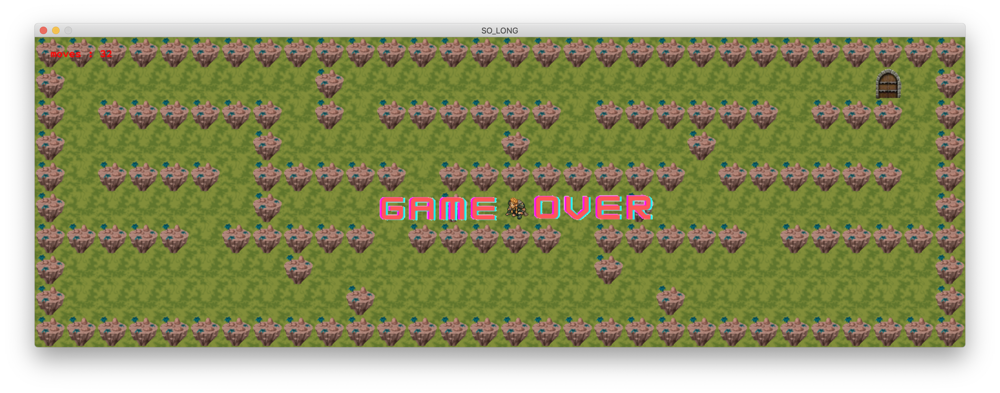
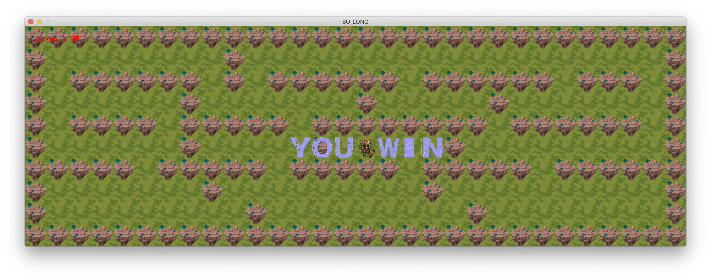

# so_long_1337
Discover the world of computer graphics with so_long_1337, a 2D game project using MiniLibX. Experience engaging gameplay and unleash your creativity in graphics programming.

 
 

## Table of Contents
- [Subject](#subject)
- [Description](#description)
- [Getting Started](#getting-started)
  - [Prerequisites](#prerequisites)
  - [Installation](#installation)
- [Usage](#usage)

## Subject :
<ol style="margin-left: 15px;">
  <li style="font-size: 20px; font-weight: 600; color: red;">
     <a href="https://cdn.intra.42.fr/pdf/pdf/106591/en.subject.pdf" target="_blank" style="color: red; font-size: 15.5px; font-weight: 300; margin-left: 10px;"> subject.pdf </a>
  </li>
</ol>

## Description :
- "so_long" is a captivating 2D adventure where players traverse a maze, aiming to collect all items before reaching the exit. Along the way, they must skillfully navigate past obstacles like walls and enemies to emerge victorious.
  
## Getting Started
### Prerequisites
- To use this program, you need a C compiler (e.g., GCC) and the make utility installed on your system.

### Installation
1. Clone the repository:
    ```bash
    git clone https://github.com/s-marsi/so_long_1337.git so_long
    cd so_long
    ```
2. Compile the program:
    ```bash
    make  # This will generate the pipex program.
    make clean      # This will remove object files.
    ```
3. Usage :
    <ul>
      <li>Execute in your bash terminal: <code>./so_long folder/file.ber</code></li>
      <li> 
        - <code>./so_long</code> : the name of the program. <br>
        - <code>maps</code> : The folder that stores map files. <br>
        - <code>map5.ber</code> : The file containing the map data. (you can make your own map)<br>
        - In the map file, you will find the following letters: 0, 1, C, E, P, N, B.
         0 represents an empty space.
         1 represents a wall.
         C represents a collectible.
         E represents the map exit.
         P represents the player's starting position.
         N represents the black bomb.
         B represents the red bomb.
      </li>
      <li> 
        The map file should have a .ber extension.
      </li>
      <li> For example : <br>
        <pre><code>./so_long maps/map5.ber</code></pre>
      </li>
    </ul>

